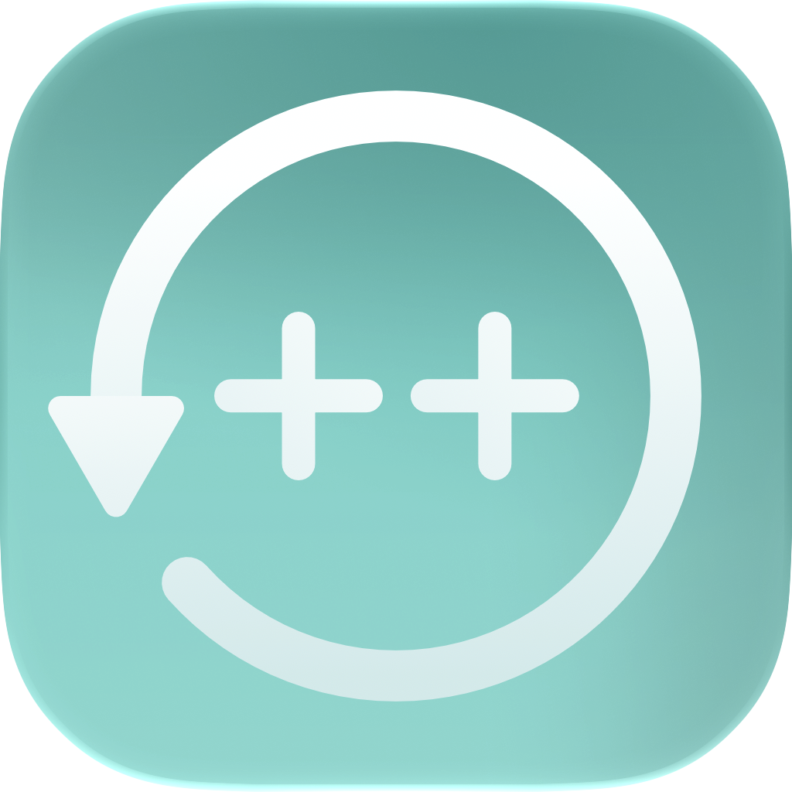

  
   
  <h1><b>TimeMachine++</b></h1>
  <a href="https://github.com/execOQ/TimeMachinePlusPlus/releases/latest/download/TimeMachine++.zip">Download for macOS</a> 
  <i>Compatible with macOS 14 and later.</i>

TimeMachine++ is a local macOS utility for managing Time Machine exclusions. It helps you set rules using regex/pattern or add exact paths, in background the app would exlude them from Time Machine backups.

> The app applies exclusions as file attributes that Time Machine respects. These exclusions may not appear in macOS System Settings, even when they are active. You can see exluded files in the app.

## Features

### Templates

Quickly add common exclusion rules for development artifacts and generated folders.

<video src=".github/assets/Rule_Template.mov" controls muted playsinline></video>

### Rules

Create and edit pattern or regex rules that TimeMachine++ applies during scans.

<video src=".github/assets/Rule.mov" controls muted playsinline></video>

### Exact Paths

Exclude a specific file or folder path when a broad pattern is not the right fit.

<video src=".github/assets/Path.mov" controls muted playsinline></video>

### Regex Helper

Describe what you want to match and let the local AI generate a regex.

<video src=".github/assets/Regex_Helper.mov" controls muted playsinline></video>

### Regex suggestions

Use inline suggestions while typing regex patterns. 

> Use `CMD+Number` for quick pasting.

<video src=".github/assets/Regex_Suggestions.mov" controls muted playsinline></video>

### Excluded Files

Review files and folders that TimeMachine++ has already excluded. Remove an exclusion or reveal using the context menu.

<video src=".github/assets/Excluded.mov" controls muted playsinline></video>

## Usage

### Manual Download

Navigate to the release page and download the latest .zip file located at the bottom, or [click me](https://github.com/execOQ/TimeMachinePlusPlus/releases).
